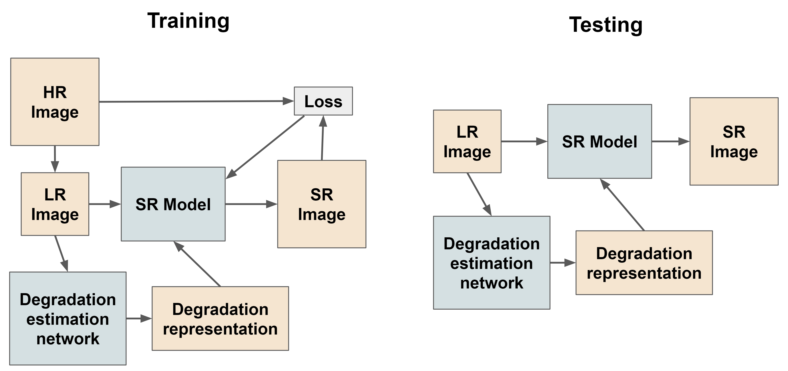
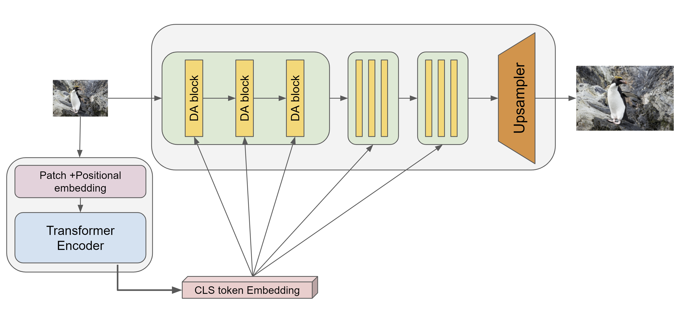
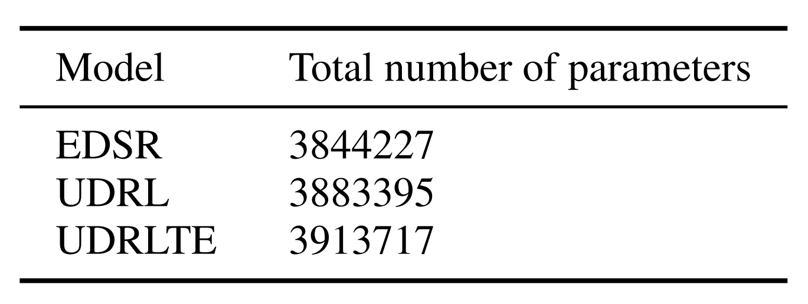
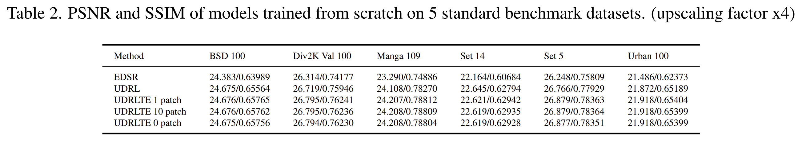

# Blind super resolution

## Introduction

Recently, researchers have been paying more attention to making the SR models more robust such that they become invariant to the degradation process of the LR image input. It is known as the blind image SR task that aims to superresolved LR images that result from an unknown degradation process and generate high-resolution (HR) images. In this repo, we present a new method and its a detailed comparative analysis as it performs better than the previous state-of-the-art Blind SR method. These methods were originally trained (by their authors) in different training and testing environments. And so, these pre-trained models cannot be compared directly. To compare these models fairly, in this repo, we reproduce and carry out our detailed experiments of training and evaluating these models under common training and testing settings.

Our method based on the framework showed in figure above, where we use a separate degradation estimation network along with the main super-resolution model. We take inspiration from a recent work called Unsupervised Degradation Representation Learning for Blind Super-Resolution (UDRL) which uses a contrastive learning-based approach to learn the degradation estimation network. By looking at the success of vision transformers in widespread computer vision tasks, we use a ViT (Vision Transformer) based backbone for our degradation estimation network. We are the first ones to try such an approach to the best of our knowledge.

This repository presents the comparision between three approaches

1. Enhanced Deep Residual Networks for Single Image Super-Resolution (EDSR)
2. Unsupervised Degradation Representation Learning for Blind Super-Resolution (UDRL) 
3. Unsupervised Degradation Representation Learning for Blind Super-Resolution with Transformer-based Encoder (UDRLTE)

All three of them were trained in blind super resolution fashion on same datasets under similar hyper-parameters.

## Architecture

We call our model UDRLTE (Unsupervised Degradation Representation Learning for Blind Super-Resolution with Transformer-based Encoder). As the name suggests we use a Transformer-based Encoder. We choose a small ViT which has about the same number of parameters as the encoder of UDRL. Our ViT also outputs a 1D vector of size 256 as the representation of the degradation and we use the CLS token output embedding to get this representation. Our ViT takes an image patch of size 48x48 as input and first, it divides it into 16 patches each of size 12x12. All the like positional embeddings, self-attention heads, and other architecture details as exactly the same as from the original ViT model. But it is significantly smaller as our ViT has only 6 self-attention heads and 3 transformer blocks. This is to keep the number of parameters about the same as UDRL encoder.

## Number of parameters

It is important to keep the number of parameters of all three models about the same for a fair comparison. The total number of parameters of UDRL and UDRLTE include both, the encoder and decoder

## Evaluation

We can clearly see that UDRLTE beats UDRL and EDSR. EDSR being a baseline clearly fails but it is because of the transformer-based backbone that UDRLTE was able to beat the original UDRL

## More details

Please refer Project_report.pdf present in this repo.

Also please refere this repository https://github.com/DevashishPrasad/superresolution for previous work related to benchmarking
